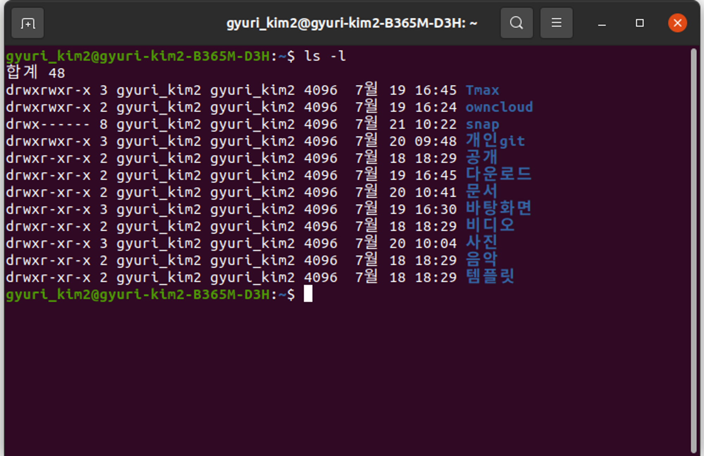

# 리눅스 퍼미션 chmod

리눅스는 모든 파일 및 디렉토리에 **퍼미션**, 즉 접근 권한을 사용한다. 다른 사람이 내 파일이나 디렉토리에 접근하여 삭제하거나 수정하면 안되니까 권한으로 방지하는 것.

퍼미션은 읽기, 쓰기, 실행에 대한 권한을 지정할 수 있다.

```bash
ls -l [디랙토리/파일 이름]
```

해당 명령어를 입력하면 파일이나 디렉토리에 대한 권한을 확인할 수 있다.



예시

`drwxr-xr-x 2 gyuri_kim2 gyuri_kim2 4096 7월 19 16:45 다운로드`

1. `drwxr-xr-x` : 파일 종류 및 권한(퍼미션)
2. `2` : 링크 수
3. `gyuri_kim2` : 사용자(소유자)
4. `gyuri_kim2` : 그룹
5. `4096` : 파일 크기
6. `7월 19 16:45` : 수정 시간
7. `다운로드` : 디렉토리/파일 이름

`drwx--x--x`

d에 부분은 디렉토리와 파일을 구분지을 때 사용된다.

`d` : 디렉토리

`-` : 파일

`c` : 캐릭터 디바이스

`s` : 네트워크 소켓 파일

`l` : 심볼릭 링크 파일(windows의 바로가기 느낌)

가장 앞 글자를 제외하고, 나머지 9글자를 3개씩 나누어 읽는다.

`d rwx --x --x`

각각 **사용자**, **그룹**, **방문자**를 뜻한다.

`r` : read, 읽기, **4**

`w` : write, 쓰기, **2**

`x` : execute, 실행, **1**

따라서, `rwx`를 조합하여 0부터 7까지 숫자를 만들어낼 수 있게 된다.

`--- --- ---` : chmod **000** permission (사용자, 그룹, 방문자 모두 아무 권한 없음)

`rwx --- ---` : chmod **700** permission (사용자만 읽기, 쓰기, 실행 모든 권한이 있음)

`rwx r-x r-x` : chmod **755** permission (그룹, 방문자는 읽기와 실행 권한이 있음)

`rwx rwx rwx` : chmod **777** permission (사용자, 그룹, 방문자 모두 읽기, 쓰기, 실행 권한이 있다)

## 파일 권한 변경 (chmod 명령어 사용하기)

파일 및 디렉토리의 권한을 변경하기 위해서는 `chmod` 명령어를 이용해야 한다.

### 1. 문자로 권한 변경

| u   | user 사용자     |
| --- | ------------ |
| g   | group 그룹     |
| o   | other 다른 사용자 |
| a   | all 전부       |

| w   | write 쓰기 권한   |
| --- | ------------- |
| r   | read 읽기 권한    |
| x   | execute 실행 권한 |

**ex**

- `chmod g+w test.c`
  - 그룹(`g`)에게 test.c 파일에 대해 쓰기(`w`) 권한을 준다(`+`)
- `chmod o-r test.c`
  - 다른 사용자(`o`)에게 test.c 파일에 대해 읽기(`r`) 권한을 뺏는다(`-`)
- `chmod g+rwx file.txt`
  - 그룹(`g`)에게 읽기(`r`), 쓰기(`w`), 실행(`x`) 권한을 준다(`+`)
- `chmod go+r file.txt`
  - 그룹과 다른 사용자(`go`)에게 읽기(`r`) 권한을 준다(`+`)

### 2. 숫자로 권한 변경

- `chmod 000 test.c`
  - 사용자, 그룹, 다른 사용자의 모든 권한을 제거한다
- `chmod 777 test.c`
  - 사용자, 그룹, 다른 사용자의 모든 권한을 추가한다
- `chmod 700 test.c`
  - 사용자에게만 모든 권한을 준다
- `chmod 744 test.c`
  - 사용자에게는 모든 권한을 주고, 다른 사용자에게는 읽기 권한만 준다

## 특수한 권한

### Set-UID (User)

- 실행하는 동안 해당 파일의 소유자 권한으로 인식
- 일반적으로 실행 파일에 사용된다
- 소유자 권한 부분의 x 자리에 s로 표기된다.
- 실행 권한이 없을 경우 대문자 S로 표기된다.

### Set-GID (Group)

- 실행하는 동안 해당 파일의 소유자그룹 권한으로 인식한다
- 일반적인 디렉토리에 설정된다
- 사용자가 파일이나 디렉터리를 생성하면 사용자가 속한 그룹에 상관없이 디렉터리 소유 그룹으로 만들어진다.
- 그룹 권한 부분의 x 자리에 s로 표기된다.
- 실행 권한이 없을 경우 대문자 S로 표기된다.

### Sticky-Bit

- 일반 사용자들이 디렉터리에서 파일 및 디렉터리 생성이 가능하다
- 일반 사용자들은 자신이 생성한 것 이외에는 수정 및 삭제가 불가능하다
- 디렉터리에만 적용된다
- 시스템 기본 폴더인 /tmp 디렉터리에 설정되어 있다.
- 설정하면 other 계층 권한 부분의 x 자리에 t로 표기된다
- 실행 권한이 없을 경우 대문자 T로 표기된다.’

Set-UID, Set-GID : `s` , `S`

Sticky-bit : `t` , `T`

예시

- chmod rwSrwxrwx
- chmod rwxrwsrwx
- chmod rwsrwsrwt

숫자 모드의 경우 : 4자리를 사용한다.

Set-UID : 4

Set-GID : 2

Sticky-bit : 1

- chmod 1744

# 파일 소유권 변경 chown

파일, 디렉토리의 사용자, 그룹을 변경할 수 있다. 파일의 소유권을 변경하는 것!

- root 사용자만 가능하다
- `sudo chown user01 a.out`
  - a.out 파일의 사용자(소유자)를 user01로 변경
- `sudo chgrp user01 test.c`
  - test.c 파일의 그룹을 user01로 변경
  - **일반 사용자**는 **자신이 속한 그룹으로만 변경**이 가능하다
- `sudo chown user02.user02 crontab.bak`
  - 파일의 사용자와 그룹을 동시에 변경한다
- `sudo chown -R user01 tmp/`
  - `-R` 옵션
  - **디렉토리**와 **그 안에 들어있는 모든 파일의 사용자**를 변경한다
